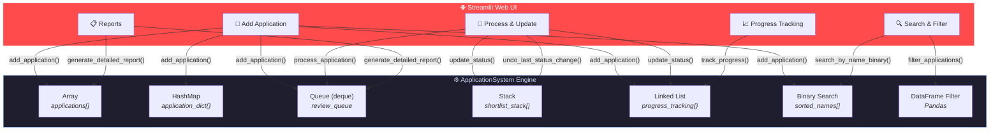

<p align="center">
  <h1 align="center">📋 Application Management System</h1>
  <p align="center">
    <strong>A Data Structures & Algorithms-Powered Applicant Tracking System</strong>
    <br />
    <em>Production-ready web UI built with Streamlit — showcasing 11 core DSA concepts in action.</em>
  </p>

  <p align="center">
    <a href="#-getting-started"></a>
    &nbsp;
    <a href="#-live-demo"></a>
  </p>

  <p align="center">
    
    
    
    
    
  </p>
</p>

---

## 📖 Table of Contents

<details>
<summary>Click to expand</summary>

- [📖 Table of Contents](#-table-of-contents)
- [🎯 The Elevator Pitch](#-the-elevator-pitch)
- [✨ Key Features](#-key-features)
- [🚀 Live Demo](#-live-demo)
- [🛠️ Tech Stack](#️-tech-stack)
- [🏗️ Architecture](#️-architecture)
- [🧬 DSA Concepts Deep-Dive](#-dsa-concepts-deep-dive)
- [⚡ Getting Started](#-getting-started)
- [📸 Usage](#-usage)
- [📁 Project Structure](#-project-structure)
- [🗺️ Roadmap](#️-roadmap)
- [🤝 Contributing](#-contributing)
- [📄 License](#-license)
- [📬 Contact](#-contact)

</details>

---

## 🎯 The Elevator Pitch

> **Tired of spreadsheet-based hiring workflows?** This Application Management System brings **enterprise-grade applicant tracking** to your browser — powered entirely by fundamental data structures under the hood.

AMS is not just another CRUD app. It's a **living showcase** of how Linked Lists, Queues, Stacks, Binary Search, and Hash Maps solve real-world problems in a recruiter's daily workflow — all wrapped in an intuitive Streamlit web interface.

---

## ✨ Key Features

| Feature | Description |
|---|---|
| 📝 **Smart Application Intake** | Rich form with name, job ID, resume link, skills, experience & education fields |
| 🔄 **FIFO Review Pipeline** | Queue-based processing ensures fair, first-come-first-served reviews |
| 📊 **Status Lifecycle** | Track applicants through `Submitted → Under Review → Shortlisted/Rejected` |
| ⏪ **One-Click Undo** | Stack-powered action reversal — never worry about accidental status changes |
| 🔍 **Binary Search Lookup** | Find any applicant in **O(log n)** by name — lightning fast at scale |
| 🎛️ **Multi-Criteria Filtering** | Filter by Job ID, Status, or Skills with Pandas-powered queries |
| 📈 **Progress Timeline** | Linked-list-based history showing every stage an applicant has passed through |
| 📋 **Analytics Dashboard** | Real-time reports: totals, per-job breakdown, status summary, queue depth |
| 🌐 **Zero-Config Web UI** | Browser-based interface — no desktop app installation required |

---

## 🚀 Live Demo

<!-- Replace the URL below with your Streamlit Cloud deployment -->
> 🔗 **[Launch the App on Streamlit Cloud →](#)**
>
> _Deploy your own instance in 1 click with [Streamlit Community Cloud](https://streamlit.io/cloud)_

---

## 🛠️ Tech Stack

<table>
  <tr>
    <td align="center" width="140">
      <br />
      <strong>Python 3.12</strong><br />
      <sub>Core Language</sub>
    </td>
    <td align="center" width="140">
      <br />
      <strong>Streamlit</strong><br />
      <sub>Web Framework</sub>
    </td>
    <td align="center" width="140">
      <br />
      <strong>Pandas</strong><br />
      <sub>Data Handling</sub>
    </td>
    <td align="center" width="140">
      <br />
      <strong>NumPy</strong><br />
      <sub>Numerical Ops</sub>
    </td>
  </tr>
</table>

---

## 🏗️ Architecture

The system is designed as a **modular monolith** — a single Python file with cleanly separated concerns: core data-structure classes and a Streamlit presentation layer.



---

## 🧬 DSA Concepts Deep-Dive

Every data structure in this project solves a **specific, real-world problem**:

| # | Data Structure | Implementation | Use Case | Time Complexity |
|---|---|---|---|---|
| 1 | **Array** (List) | `self.applications[]` | Store all application records | O(1) append |
| 2 | **Hash Map** (Dict) | `self.application_dict{}` | O(1) lookup by applicant name | O(1) avg |
| 3 | **Queue** (deque) | `self.review_queue` | FIFO processing — first applied, first reviewed | O(1) enqueue/dequeue |
| 4 | **Stack** (List) | `self.shortlist_stack[]` | Undo/redo status changes (LIFO) | O(1) push/pop |
| 5 | **Linked List** | `class LinkedList` | Track full status history per applicant | O(n) traversal |
| 6 | **Binary Search** | `bisect.insort()` / `bisect_left()` | Fast name lookup in sorted order | O(log n) search |
| 7 | **Node** | `class Node` | Building block for linked list | — |
| 8 | **DataFrame** | `pd.DataFrame()` | Tabular filtering and analytics | Vectorized |

<details>
<summary>💡 <strong>Why these choices?</strong></summary>

- **Queue over List for reviews**: `deque.popleft()` is O(1) vs O(n) for `list.pop(0)` — critical as applications scale to thousands.
- **Stack for undo**: Naturally models "last change first undone" semantics — the same pattern used by Ctrl+Z in every editor.
- **Linked List for progress**: Dynamic, ordered history without pre-allocating memory — each `append()` adds exactly one node.
- **Binary Search over Linear Scan**: With `bisect`, searching 10,000 sorted names takes ~14 comparisons instead of 10,000.

</details>

---

## ⚡ Getting Started

### Prerequisites

| Requirement | Version |
|---|---|
| Python | 3.10+ |
| pip | Latest |
| Git | Any |

### Installation

```bash
# 1. Clone the repository
git clone https://github.com/SukeshShetty1010/AMS.git
cd AMS

# 2. Create & activate a virtual environment
python -m venv venv

# Windows
venv\Scripts\activate
# macOS / Linux
source venv/bin/activate

# 3. Install dependencies
pip install -r requirements.txt

# 4. Launch the app 🚀
streamlit run application_management_system.py
```

The app will open automatically at **`http://localhost:8501`** 🎉

### One-Liner (After Setup)

```bash
streamlit run application_management_system.py
```

---

## 📸 Usage

The application has **5 main pages**, accessible via the sidebar:

<details>
<summary><strong>1️⃣ Add Application</strong></summary>

Fill out the applicant form with name, job ID, resume link, skills, experience, and education. On submit, the applicant is automatically:
- Appended to the **applications array**
- Indexed in the **hash map** for O(1) lookup
- Enqueued in the **review queue**
- Registered in the **progress tracker** (linked list)
- Inserted into the **sorted names list** (for binary search)

</details>

<details>
<summary><strong>2️⃣ Process & Update</strong></summary>

- **Process Queue**: Dequeues the next applicant (FIFO) and sets their status to "Under Review"
- **Update Status**: Change any applicant's status — each change is pushed onto the **undo stack**
- **Undo**: Pop the last status change and revert it instantly

</details>

<details>
<summary><strong>3️⃣ Search & Filter</strong></summary>

- **Binary Search**: Type an exact name for O(log n) lookup
- **Multi-Filter**: Combine Job ID + Status + Skills filters — powered by Pandas DataFrame queries
- **All Applications**: View the full table of submitted applications

</details>

<details>
<summary><strong>4️⃣ Progress Tracking</strong></summary>

Select an applicant to see their full status timeline, rendered step-by-step from the linked list:

```
Step 1: Submitted
Step 2: Under Review
Step 3: Shortlisted
```

</details>

<details>
<summary><strong>5️⃣ Reports & Analytics</strong></summary>

Generate real-time metrics:
- **Total Applications** count
- **Queue Depth** — how many are waiting for review
- **Applications per Job ID** breakdown
- **Status Summary** — shortlisted vs rejected vs pending

</details>

---

## 📁 Project Structure

```
AMS/
├── 📄 application_management_system.py   # All-in-one: DSA engine + Streamlit UI (260 lines)
├── 📋 requirements.txt                   # Pinned Python dependencies (38 packages)
├── 📖 README.md                          # You are here
└── 🐍 DSA/                               # Python virtual environment (gitignored)
```

> **Why a single file?** This project intentionally keeps everything in one file to demonstrate that **production-quality DSA implementations don't need complex architectures.** Each class and function is clearly separated with comments and follows the Single Responsibility Principle.

---

## 🗺️ Roadmap

- [ ] 💾 **Persistent Storage** — Add SQLite/PostgreSQL backend so data survives restarts
- [ ] 🔐 **Authentication** — Role-based access (Recruiter vs Admin vs Viewer)
- [ ] 🐳 **Docker Support** — One-command deployment with `docker-compose`
- [ ] 🔌 **REST API** — FastAPI layer for headless integrations
- [ ] 📧 **Email Notifications** — Auto-notify applicants on status change
- [ ] 📊 **Visual Analytics** — Altair/Plotly charts for hiring funnel visualization
- [ ] 🧪 **Unit Tests** — pytest suite for all DSA operations
- [ ] ☁️ **Cloud Deploy** — One-click deploy to Streamlit Community Cloud

---

## 🤝 Contributing

Contributions are what make the open-source community amazing. Any contributions you make are **greatly appreciated**.

1. **Fork** the repository
2. **Create** your feature branch (`git checkout -b feature/amazing-feature`)
3. **Commit** your changes (`git commit -m 'Add amazing feature'`)
4. **Push** to the branch (`git push origin feature/amazing-feature`)
5. **Open** a Pull Request

> **First-time contributor?** Look for issues tagged `good first issue` 💚

---

## 📄 License

Distributed under the **MIT License**. See `LICENSE` for more information.

---

## 📬 Contact

**Sukesh Shetty** — [GitHub](https://github.com/SukeshShetty1010)

⭐ **If this project helped you, please give it a star!** ⭐

---

<p align="center">
  <sub>Built with ❤️ and <strong>Data Structures</strong></sub>
</p>